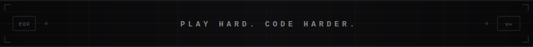

<div align="center">


</div>

<br/>

<div align="center">

[](https://github.com/harish-30-git)

</div>

<br/>

---

## 🏟️ The Scorecard

> *Every great innings starts with one good delivery. Here's mine.*

```
╔══════════════════════════════════════════════════════════════════╗
║          P HARISH  —  DEVELOPER INNINGS  —  IN PROGRESS         ║
╠══════════╦══════════════╦══════════════╬═════════╦══════════════╣
║  PLAYER  ║    STACK     ║   PROJECTS   ║  OVERS  ║    STATUS    ║
╠══════════╬══════════════╬══════════════╬═════════╬══════════════╣
║ P Harish ║ React+Python ║  Full Stack  ║ 3rd yr  ║  NOT OUT 🏏  ║
╚══════════╩══════════════╩══════════════╩═════════╩══════════════╝

  BATTING:  React ██████████  Python ████████░░  JS ████████░░
  BOWLING:  Flask ████████░░  Pandas ████████░░  ML ███████░░░
  FIELDING: Git ████████░░  Design ██████░░░░  APIs ████████░

  CURRENT STRIKE RATE: Shipping fast 🔥
  PLAYING FOR: Open Source + Real World Impact
```

---


## 🧠 `$ cat about.yml`

```yaml
# ─────────────────────────────
#  P HARISH  |  Developer File
# ─────────────────────────────

identity:
  name     : "P Harish"
  role     : "Full Stack Developer"
  year     : "Pre-Final Year B.Tech IT"
  location : "India 🇮🇳"
  email    : "srihariprakash1112@gmail.com"

cricket_brain_applied_to_code:
  powerplay  : "Architecture & planning"
  middle_overs: "Feature development"
  death_overs : "Debugging & deployment"
  yorker     : "That one fix at 2AM 🌙"

philosophy: >
  I treat every project like a T20 match.
  Plan it. Build it. Ship it. Win it.

open_to:
  - Collaborations
  - Internships
  - Cool ideas over chai ☕
```

<br clear="right"/>

---

## ⚡ Playing XI — Tech Stack

> *My first-choice eleven. No substitutes needed.*

<div align="center">

| # | Player | Role | Form |
|---|--------|------|------|
| 1 |  | Opener — UI/Frontend | 🔥 Hot |
| 2 |  | Opener — Logic Layer | 🔥 Hot |
| 3 |  | #3 — The Anchor | 💪 Solid |
| 4 |  | #4 — Strokeplay | 🔥 Hot |
| 5 |  | #5 — All Rounder | 💪 Solid |
| 6 |  | #6 — Data Muscle | 💪 Solid |
| 7 |  | #7 — ML Finisher | 📈 Growing |
| 8 |  | #8 — The Showman | 💪 Solid |
| 9 |  | #9 — Database Keeper | 📈 Growing |
| 10 |  | #10 — Support Bowler | 💪 Solid |
| 11 |  | #11 — Tail-end Designer | 📈 Growing |

</div>

---

## 🌐 Full Tech Arsenal

<div align="center">


</div>

---

## 📊 Stats Board

<div align="center">


</div>

<div align="center">

[](https://github.com/harish-30-git)

</div>

---

## 🏆 Trophy Cabinet

<div align="center">

[](https://github.com/harish-30-git)

</div>

---

## 🎙️ On The Field

<div align="center">

```
┌─────────────────────────────────────────────────────────┐
│                                                         │
│   "In cricket, you play the ball not the bowler.        │
│    In code, you solve the problem not the language."    │
│                                                         │
│                                          — P Harish     │
└─────────────────────────────────────────────────────────┘
```

</div>

---

## 📬 Pitch To Me

<div align="center">

*Open for collabs, internships, or just cricket talk 🏏*

<br/>

<a href="https://www.linkedin.com/in/p-harish-7958a8311">

</a>
&nbsp;
<a href="https://www.instagram.com/__harish__7__">

</a>
&nbsp;
<a href="mailto:srihariprakash1112@gmail.com">

</a>

<br/><br/>


</div>

<br/>

<div align="center">



</div>
